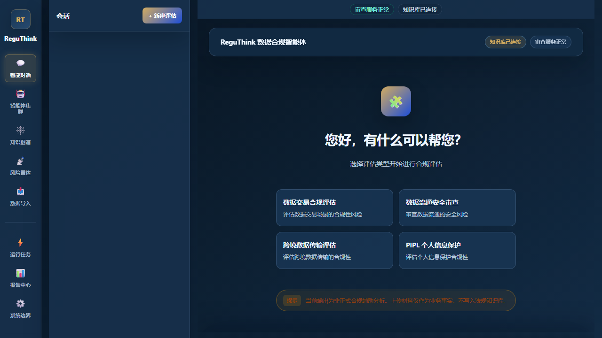
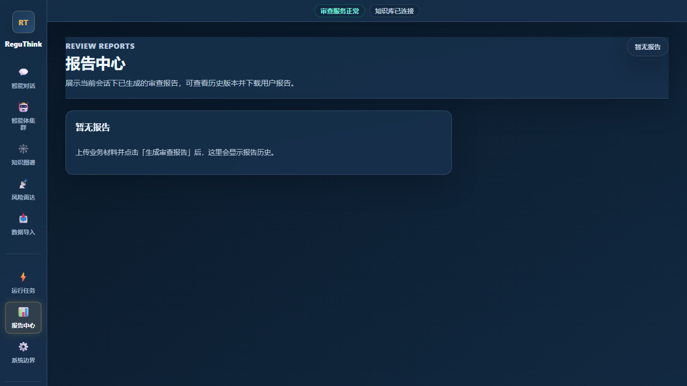
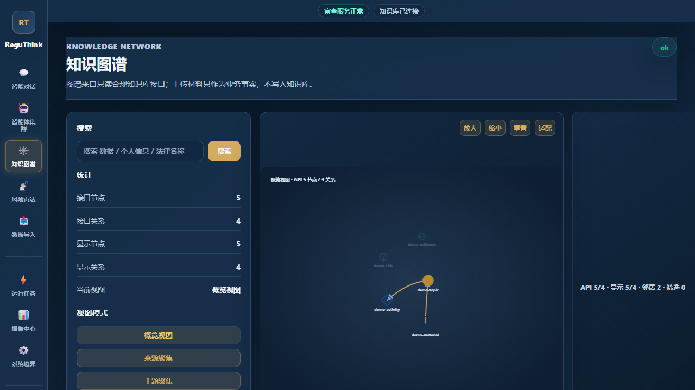
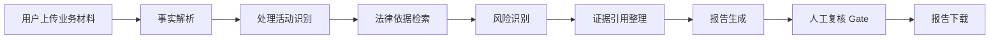

# ReguThink：多智能体数据合规审查与报告生成原型系统

**A Multi-Agent Compliance Review Prototype for Data Transaction Scenarios**

ReguThink 是一个面向数据交易、数据流通和企业数据治理场景的多智能体合规审查原型系统，围绕“业务材料上传 -> 事实解析 -> 法律依据检索 -> 风险识别 -> 证据引用绑定 -> 合规报告生成 -> 人工复核”构建端到端产品链路。

## Core Highlights

| 亮点 | 说明 |
| --- | --- |
| 多智能体协同 | 将事实解析、处理活动识别、法律依据检索、风险识别、证据整理、报告生成拆分为可审查流程 |
| Hybrid RAG + 知识图谱 | 结合关键词/语义检索、图谱关系与证据绑定，降低无依据报告生成风险 |
| 证据引用边界 | 报告中显式区分业务事实、适用依据、推理结论和人工复核状态 |
| 前后端展示原型 | React + TypeScript + Vite 前端，FastAPI 后端，支持本地演示和接口扩展 |
| 评价体系 | 围绕场景识别、依据覆盖、证据一致性、引用准确性、边界控制和可读性设计质量检查 |

## Demo Preview



| 报告中心 | 知识图谱 |
| --- | --- |
|  |  |

## 项目背景与痛点

- 法规依据分散，业务团队难以快速定位适用条款。
- 业务事实与法律依据难以稳定绑定，报告结论容易失去证据边界。
- LLM 直接生成合规报告时可能出现依据缺失、泛化结论或过度承诺。
- 报告质量缺少结构化评价，人工复核链路不清晰。
- 数据交易、数据流通、企业数据治理场景需要更可解释的审查工作流。

## 核心功能

- 业务材料上传
- 交互式问答
- 多智能体协同审查
- Hybrid RAG 检索
- 知识图谱可视化
- 证据与引用绑定
- 合规报告生成
- 人工复核 Gate
- 报告质量评价体系

## 系统工作流



## 多智能体设计

| Agent | 职责 |
| --- | --- |
| 业务事实解析 Agent | 从上传材料和对话中抽取业务主体、数据类型、交易目的、交付方式等事实 |
| 处理活动识别 Agent | 将业务事实映射到收集、存储、加工、传输、提供、公开等处理活动 |
| 法律依据检索 Agent | 基于问题和事实检索相关法规、规范、条款摘要和适用边界 |
| 风险识别 Agent | 识别授权同意、最小必要、敏感信息、出境、委托处理、再识别等风险 |
| 证据与引用整理 Agent | 将事实、依据、风险与引用片段绑定，标记证据缺口 |
| 报告生成 Agent | 生成结构化合规审查报告、整改建议和复核提示 |
| Human Review Gate | 对高风险结论、证据缺口和法律判断保留人工复核入口 |

## Hybrid RAG 与知识图谱设计

ReguThink 的公开展示版只保留设计说明和脱敏示例，不包含私有法规知识库、向量数据库、图数据库或真实业务材料。系统设计上将向量检索用于语义召回，将关键词/规则检索用于稳定命中，将知识图谱用于展示法规主题、处理活动、风险类型和证据之间的关系。报告生成阶段只应引用已绑定证据，不能把模型推断包装为已核验事实。

## 报告结构

示例报告通常包含：

- 审查对象与材料范围
- 业务事实摘要
- 适用法律依据
- 核心风险
- 证据与引用
- 整改建议
- 人工复核状态
- 免责声明

## 评价体系

| 维度 | 关注点 |
| --- | --- |
| 场景识别 | 是否准确识别数据交易/流通/治理场景 |
| 法律依据覆盖 | 是否覆盖与场景相关的主要依据 |
| 证据一致性 | 结论是否能回到上传材料或检索证据 |
| 引用准确性 | 引用是否与结论相匹配，是否避免过度引用 |
| 风险识别 | 是否识别核心合规风险和证据缺口 |
| 结论边界 | 是否避免把辅助分析写成正式法律意见 |
| 报告可读性 | 结构是否清晰，业务方是否容易复核 |
| 人工复核提示 | 是否标出需要人工确认的高风险项 |

## 技术栈

**Frontend**

- React
- TypeScript
- Vite

**Backend**

- FastAPI
- Python
- RESTful API
- File upload
- Conversation / job management prototype

**AI / RAG**

- Multi-Agent workflow
- Hybrid RAG
- Knowledge graph
- Evidence citation binding
- Report evaluation

## 本地启动

后端：

```powershell
cd services\backend_api_v2
python -m uvicorn app.main:app --host 127.0.0.1 --port 8012
```

前端：

```powershell
cd services\frontend_api_v2
npm install
npm run dev -- --host 127.0.0.1 --port 5173 --strictPort
```

访问：

```text
http://127.0.0.1:5173/
```

前端默认使用相对 `/api/v1` 路径；本地开发由 Vite proxy 转发到后端。

## 环境变量

使用 `.env.example` 作为配置模板。不要提交真实 `.env`、API key、访问令牌、数据库密码、Cookie 或本地私有路径。

## 我的主要贡献

- 设计数据交易合规多智能体产品链路。
- 梳理 18 类典型数据合规场景。
- 设计上传材料、智能问答、报告生成、证据引用、人工复核流程。
- 参与 Hybrid RAG 与知识图谱链路设计。
- 构建报告质量评价体系。
- 推动前后端从工程调试态到产品展示态。

## 项目边界

本项目为研究/原型展示，不构成正式法律意见。公开仓库仅为脱敏展示版，不包含完整法规知识库、向量数据库、图数据库、真实用户材料、真实业务日志、密钥和本地缓存。

## Roadmap

- 完善材料解析
- 强化条款级引用
- 优化图谱交互
- 增强人工复核流程
- 支持容器化部署
- 上线在线 Demo
