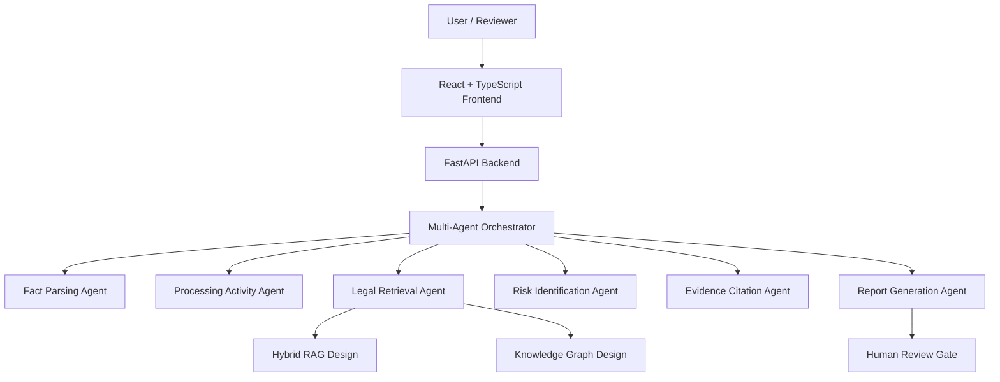

# System Architecture Diagram

```mermaid
flowchart TB
  User[User / Reviewer] --> FE[React + TypeScript Frontend]
  FE --> API[FastAPI Backend]
  API --> Orchestrator[Multi-Agent Orchestrator]
  Orchestrator --> Fact[Fact Parsing Agent]
  Orchestrator --> Activity[Processing Activity Agent]
  Orchestrator --> Retrieval[Legal Retrieval Agent]
  Orchestrator --> Risk[Risk Identification Agent]
  Orchestrator --> Evidence[Evidence Citation Agent]
  Orchestrator --> Report[Report Generation Agent]
  Retrieval --> RAG[Hybrid RAG Design]
  Retrieval --> Graph[Knowledge Graph Design]
  Report --> Review[Human Review Gate]
```
