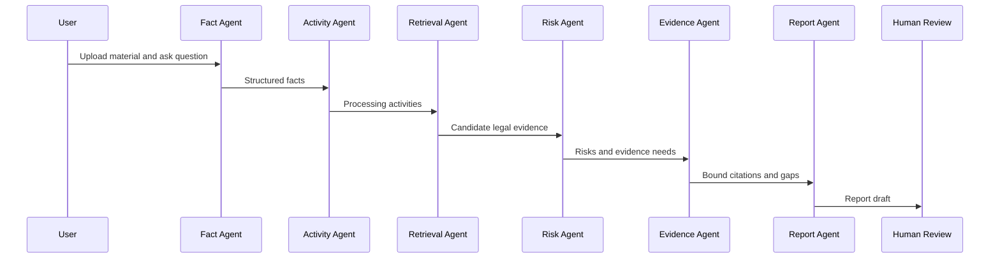

# Multi-Agent Workflow

ReguThink 将数据合规审查拆分为多个职责明确的智能体，降低单个模型直接生成报告造成的不可解释风险。

| Agent | 输入 | 输出 |
| --- | --- | --- |
| 业务事实解析 Agent | 上传材料、用户问题、补充问答 | 业务主体、数据类型、交易目的、数据流向、材料范围 |
| 处理活动识别 Agent | 业务事实 | 收集、存储、加工、传输、提供、公开等处理活动 |
| 法律依据检索 Agent | 场景、处理活动、风险关键词 | 候选法规依据、适用边界、证据片段 |
| 风险识别 Agent | 事实、处理活动、依据摘要 | 风险清单、风险等级、证据缺口 |
| 证据与引用整理 Agent | 候选依据、风险、事实 | 证据绑定表、引用摘要、待复核项 |
| 报告生成 Agent | 结构化事实、风险、引用 | 合规审查报告草稿 |
| Human Review Gate | 报告草稿、证据缺口 | 人工复核状态和最终确认提示 |

## Collaboration Flow

## Boundary

公开展示版不包含私有提示词、真实评分细则、真实知识库数据或真实用户材料。智能体说明仅用于展示系统设计。
